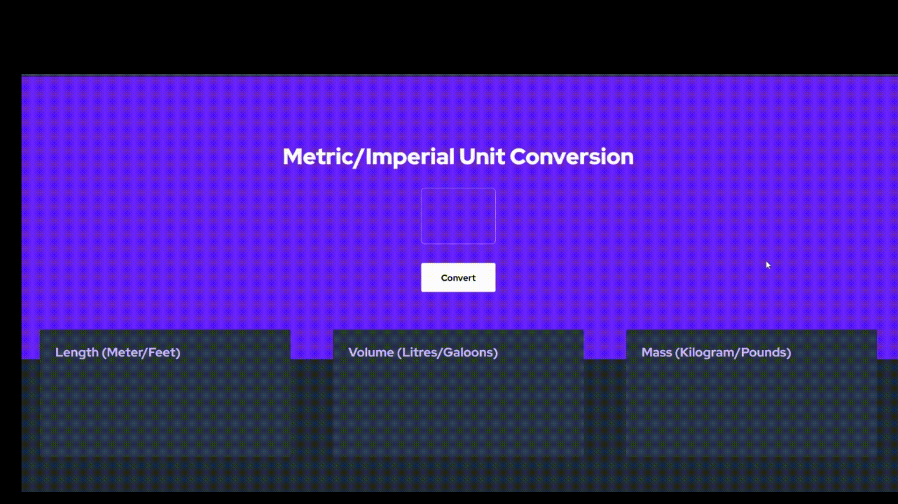
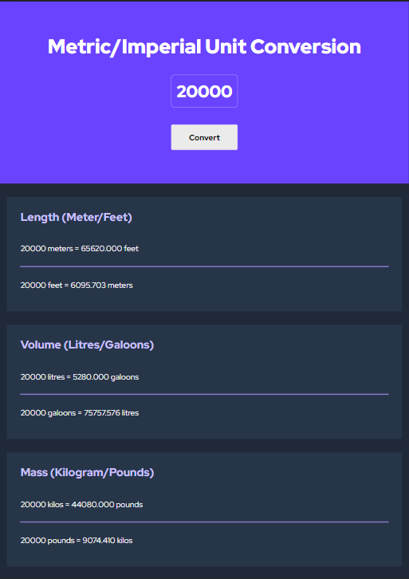

# Unit Conversion App

- This is my solution to a solo project in Scrimba [JavaScript course](https://scrimba.com/learn/learnjavascript).
- This app offers a simple solution to the problem of converting length, volume, and mass units from metric to imperial or vice versa.
- Just type the number you want to convert, and the app will show all of the conversions at once. 
- I built this project from scratch and added more functionalities than what was asked such as responsiveness and different UI for desktop and mobile. 
- Hope you like it! 🙌🏼

## Table of contents

- [Overview](#overview)
  - [Links](#links)
  - [Demo](#demo)
  - [Screenshot](#screenshot)
- [My process](#my-process)
  - [Built with](#built-with)
  - [What I learned](#what-i-learned)
- [Author](#author)
- [Acknowledgments](#acknowledgments)

## Overview

### Links

- Solution URL: [Link](https://github.com/amir-the6th/Unit-Converter)
- Live Site URL: [Link](https://boisterous-licorice-ae66c1.netlify.app)

### Demo
(⌛ please wait for complete loading if not shown yet)

### Screenshot

#### Desktop

#### Mobile

## My process

### Built with

- HTML5 markup
- Pure CSS
- Vanilla JavaScript

### What I learned

The only difficult part of this challenge was adding responsiveness. 

I struggled to set the width of the columns to 100% on tablets and mobiles. 

During learning how to fix this, I learned about these definitions:
- `flex-grow`
- `flex-shrink`
- `flex-basis`
- `width: max-content`

Overall, I enjoyed my time working on this project. CSS can become quite challenging, but when learned the right way, any challenge can be tackled easily.

## Author

- Website - [Amir Sabagh](https://arsenicolos.com)
- GitHub - [@amir-the6th](https://github.com/amir-the6th)
- LinkedIn - [Amir Sabagh](https://linkedin.com/in/arsenicolos)

## Acknowledgments

I want to give a shout-out to the [Scrimba](https://scrimba.com) CEO and professor, Per Harald Borgen([@perborgen](https://github.com/perborgen)). I recently finished the [HTML and CSS](https://scrimba.com/learn/htmlandcss) course on Scrimba and am currently doing the follow-up course, [Learn JavaScript for Free](https://scrimba.com/learn/learnjavascript).
